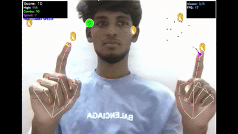

# AR Coin Game 🪙 — The updated version is available in the folder "game2.0". Check it out!
# AR Coin Game 🪙

An interactive Augmented Reality coin-catching game using computer vision and hand tracking. Catch falling coins with your hand movements while avoiding dangerous bombs!

## 🎮 Game Overview

AR Coin Game is a fun, gesture-controlled game where you use your hand to catch coins falling from the top of the screen. The game uses your webcam to track your hand movements in real-time, creating an immersive AR experience.

### Game Objectives
- Catch as many coins as possible using your index finger
- Avoid touching bombs (they end the game!)
- Don't let too many coins fall off the screen
- Challenge yourself as the game speed increases with your score

## 🚀 Features

- **Real-time Hand Tracking**: Uses MediaPipe for accurate hand detection
- **Dynamic Difficulty**: Game speed increases as your score grows
- **Sound Effects**: Coin collection sounds and background music
- **Visual Feedback**: Clear score display and game over screen
- **Bomb Obstacles**: Adds challenge and strategy to gameplay
- **Restart Functionality**: Press 'R' to restart after game over
## Demo

## 🛠 Requirements

### Python Dependencies
```bash
pip install opencv-python
pip install numpy
pip install mediapipe
pip install pygame
```

### System Requirements
- Python 3.7+
- Webcam/Camera
- Windows, macOS, or Linux

### Required Assets
The game needs the following files in the same directory as the script:

#### Images (PNG format with transparency)
- `coin.png` - Coin sprite image
- `bomb.png` - Bomb sprite image

#### Audio Files (WAV format)
- `background.wav` - Background music (optional)
- `coin_sound.wav` - Sound effect when collecting coins (optional)
- `game-over.wav` - Game over sound effect (optional)

## 📁 Project Structure
```
ar-coin-game/
├── game.py          # Main game script
├── coin.png                 # Coin sprite image
├── bomb.png                 # Bomb sprite image
├── background.wav           # Background music (optional)
├── coin_sound.wav          # Coin collection sound (optional)
├── new_high_score.wav      # new high score sound
├── game-over.wav           # Game over sound (optional)
└── README.md               # This file
```

## 🎯 How to Play

### Setup
1. Ensure your webcam is connected and working
2. Place all required asset files in the same directory as the game script
3. Run the game: `python game.py`

### Controls
- **Hand Movement**: Move your hand in front of the camera to control the game
- **Index Finger**: Your index finger tip is the collision point for catching coins
- **Q Key**: Quit the game
- **R Key**: Restart the game (only when game over)

### Gameplay Rules
1. **Catch Coins**: Move your index finger to touch falling gold coins (+1 point each)
2. **Avoid Bombs**: Don't touch the falling bombs (instant game over!)
3. **Don't Miss**: You can only miss 5 coins before the game ends
4. **Increasing Difficulty**: Every 7 points, the falling speed increases
5. **Bomb Frequency**: Bombs appear every 2 points scored

## 🎮 Game Mechanics

### Scoring System
- **+1 point** for each coin collected
- **Game Over** conditions:
  - Touching a bomb
  - Missing 5 or more coins

### Dynamic Elements
- **Fall Speed**: Starts at 3 pixels/frame, increases by 1 every 7 points
- **Bomb Spawning**: Bombs appear when score is even (2, 4, 6, 8...)
- **Multiple Coins**: 5 coins fall simultaneously at different positions

### Hand Tracking
- Uses MediaPipe to detect hand landmarks
- Tracks index finger tip (landmark 8) for collision detection
- Works with up to 2 hands simultaneously
- Red dot shows detected finger position

## 🔧 Customization

### Game Settings
You can modify these variables in the script to customize gameplay:

```python
# Game difficulty
initial_fall_speed = 3      # Starting falling speed
max_missed_coins = 5        # Maximum coins you can miss
num_coins = 5              # Number of coins falling at once

# Object sizes
coin_size = 60             # Coin diameter in pixels
bomb_size = 70             # Bomb diameter in pixels

# Display settings
desired_screen_width = 1280 # Game window width
```

### Audio Settings
- Background music loops continuously
- Sound effects are optional (game works without them)
- All audio files should be in WAV format for best compatibility

## 🐛 Troubleshooting

### Common Issues

**Camera not detected:**
- Ensure webcam is connected and not used by other applications
- Try changing `cv2.VideoCapture(0)` to `cv2.VideoCapture(1)` for external cameras

**Missing asset files:**
- Make sure all PNG and WAV files are in the same directory as the script
- The game will print error messages for missing files

**Hand tracking not working:**
- Ensure good lighting conditions
- Keep your hand clearly visible to the camera
- Try adjusting camera position and angle

**Performance issues:**
- Close other applications using the camera
- Reduce `desired_screen_width` for better performance on slower systems

**Audio not working:**
- Check if WAV files are valid and not corrupted
- Ensure your system has working audio drivers
- Audio files are optional - the game works without them

## 🎨 Creating Custom Assets

### Coin Image (`coin.png`)
- Size: 60x60 pixels (or larger, will be resized)
- Format: PNG with transparency (alpha channel)
- Style: Bright, easily distinguishable gold coin

### Bomb Image (`bomb.png`)
- Size: 70x70 pixels (or larger, will be resized)
- Format: PNG with transparency (alpha channel)
- Style: Dark, menacing bomb design

### Audio Files
- Format: WAV (recommended) or other pygame-supported formats
- `background.wav`: Upbeat, looping background music
- `coin_sound.wav`: Short, pleasant coin collection sound
- `game-over.wav`: Dramatic game over sound effect

## 📈 Performance Tips

- **Good Lighting**: Ensure adequate lighting for better hand detection
- **Solid Background**: Plain backgrounds work better than cluttered ones
- **Camera Position**: Position camera at chest/shoulder height for optimal tracking
- **Hand Visibility**: Keep your entire hand visible within the camera frame

## 🤝 Contributing

Feel free to contribute improvements:
- Enhanced visual effects
- Additional game modes
- Better sound integration
- Performance optimizations
- New obstacle types

## 📄 License

This project is open source. Feel free to modify and distribute as needed.

## 🎯 Future Enhancements

Potential improvements for future versions:
- Power-ups and special coins
- Multiple difficulty levels
- High score system with persistence
- Gesture-based controls (peace sign, thumbs up, etc.)
- Multiplayer support
- Better graphics and animations
- Mobile device support

---

**Enjoy playing AR Coin Game! 🎮✨**